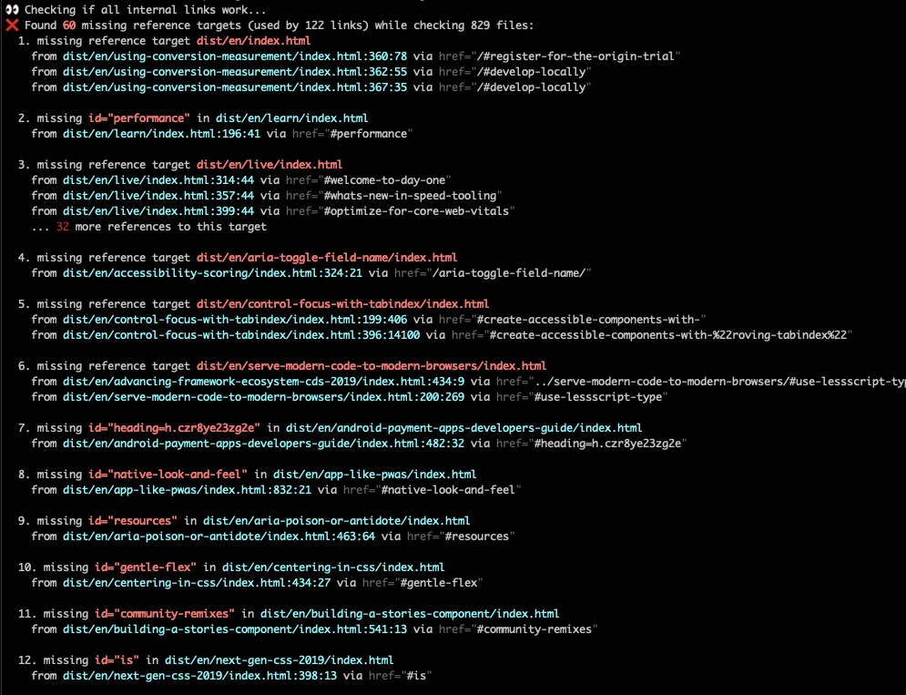

# Tools >> Check HTML Links ||30

A fast checker for broken links/references in HTML.

## Features

- Checks all html files for broken local links/references (in href, src, srcset)
- Focuses on the broken reference targets and groups references to it
- Fast (can process 500-1000 documents in ~2-3 seconds)
- Has only 3 dependencies (and 19 in the full tree)
- Uses [sax-wasm](https://github.com/justinwilaby/sax-wasm) for parsing streamed HTML

## Installation

```
npm i -D check-html-links
```

## Usage

```
npx check-html-links _site
```

## Example Output



## Comparison

Checking the output of [11ty-website](https://github.com/11ty/11ty-website) with 13 missing reference targets (used by 516 links) while checking 501 files. (on January 17, 2021)

| Tool             | Lines printed | Times  | Lang | Dependency Tree |
| ---------------- | ------------- | ------ | ---- | --------------- |
| check-html-links | 38            | ~2.5s  | node | 19              |
| link-checker     | 3000+         | ~11s   | node | 106             |
| hyperlink        | 68            | 4m 20s | node | 481             |
| htmltest         | 1000+         | ~0.7s  | GO   | -               |
