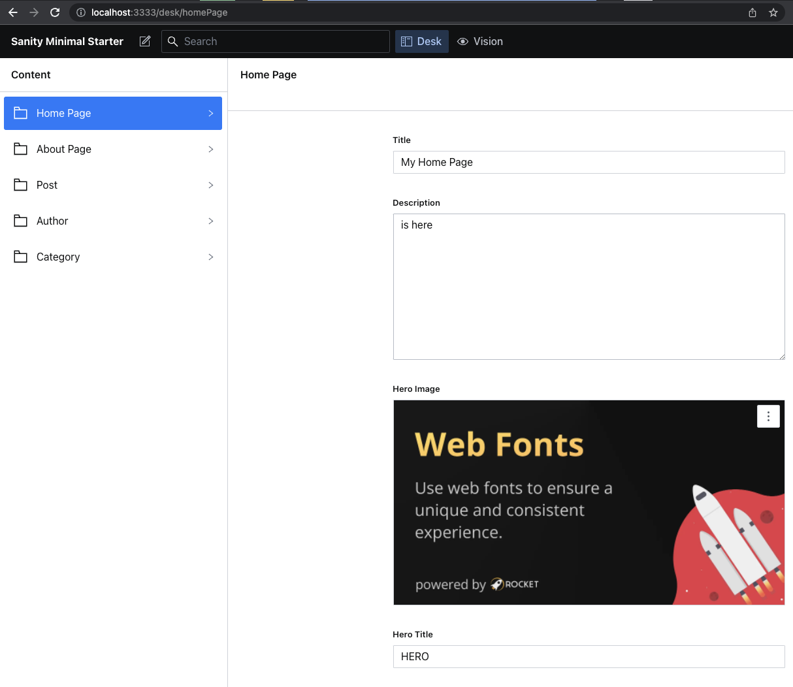

# Rocket Starter Kit: Sanity Minimal Starter

```
npx @rocket/create@latest --template 04-sanity-minimal-starter
```

> 🧑‍🚀 **Seasoned astronaut?** Delete this file. Have fun!

## 🚀 Project Structure

We run in parallel a dedicated Sanity backend and a Rocket frontend.

```
.
├── frontend   <<-- the Rocket Site
├── backend    <<-- the Sanity Backend
└── packages.json
```

## Initial Sanity Setup

1. If you don't have the Sanity CLI already run `npm install -g @sanity/cli`
2. Open a terminal from the root folder of the project
3. `cd backend`
4. `sanity install`
5. `sanity init` and follow the prompts (you will need to create a Sanity account if you haven't already)

   It will look something like this:

   ```
   ? The current folder contains a configured Sanity studio. Would you like to reconfigure it? Yes
   The Sanity Studio in this folder will be tied to a new project on Sanity.io!
   The previous project configuration will be overwritten.
   We're first going to make sure you have an account with Sanity.io. Hang on.
   Press ctrl + C at any time to quit.

   We can't find any auth credentials in your Sanity config
   - log in or create a new account

   ? Login type Google

   Opening browser at https://api.sanity.io/v1/auth/...

   Login successful
   Good stuff, you're now authenticated. You'll need a project to keep your
   datasets and collaborators safe and snug.
   ? Project name: [[ Your Project Name ]]
   Your content will be stored in a dataset that can be public or private, depending on
   whether you want to query your content with or without authentication.
   The default dataset configuration has a public dataset named "production".
   ? Use the default dataset configuration? Yes
   ✔ Creating dataset
   Skipping installation of dependencies since node_modules exists.
   Run sanity install to reinstall dependencies

   Success! Now what?

   ▪ sanity docs to open the documentation in a browser
   ▪ sanity manage to open the project settings in a browser
   ▪ sanity help to explore the CLI manual
   ▪ sanity start to run your studio

   ? We have an excellent developer community, would you like us to send you an invitation to join? Yes
   ```

6. Open your project on https://www.sanity.io/manage
   1. Go to your project
   2. Copy the PROJECT ID
7. Rename `.env.template` to `.env` and
8. Set SANITY_PROJECT_ID value with your PROJECT ID

### Run Backend (Sanity Studio)

1. Open a terminal located at the `backend` folder
2. `sanity start`
3. Log into your local Sanity Studio [http://localhost:3333](http://localhost:3333)
4. Fill in content for at least the Home Page
5. Publish your changes with the publish button in the bottom right corner

   

For more details please check the [Backend Readme](./backend/README.md)

### Run Frontend (Rocket)

1.  Open a terminal located at the `frontend` folder
2.  `npm install`
3.  `npm start`
4.  Your Rocket site should be running on [http://localhost:8000](http://localhost:8000)
5.  `npm run build` to build to production locally

For more details please check the [Frontend Readme](./frontend/README.md)

## 👀 Want to learn more?

Feel free to check [our documentation](https://rocket.modern-web.dev) or jump into our [Discord server](https://rocket.modern-web.dev/chat).
