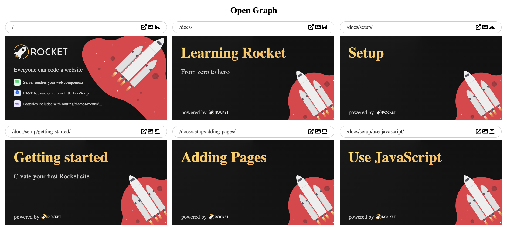

```js server
/* START - Rocket auto generated - do not touch */
export const sourceRelativeFilePath = '10--docs/30--guides/20--social-media.rocket.md';
import {
  html,
  layout,
  setupUnifiedPlugins,
  components,
  openGraphLayout,
} from '../../recursive.data.js';
export { html, layout, setupUnifiedPlugins, components, openGraphLayout };
/* END - Rocket auto generated - do not touch */
```

# Social Media

Having a nice preview image for social media can be very helpful.
For that reason Rocket has a specific functionality to generate a preview image.

This functionality is disable by default. You can enable it by exporting a `openGraphLayout` function/class instance.

The functionality is the same as normal [Layouts](../20--basics/50--layouts.rocket.md).

## How it works

1. Whenever a HTML page is rendered and there is an `openGraphLayout` defined it will create an additional `filename.opengraph.html` file.

   Here are some examples

   ```
   site/pages/index.rocket.md        -> mysite.com/index.opengraph.html
   site/pages/about.rocket.md        -> mysite.com/about/index.opengraph.html
   site/pages/about/index.rocket.js  -> mysite.com/about/index.opengraph.html
   site/pages/about/me.rocket.html   -> mysite.com/about/me/index.opengraph.html
   site/pages/404.html.rocket.js     -> mysite.com/404.openGraph.html
   site/pages/sitemap.xml.rocket.js  -> open graph only happens for html files
   ```

2. During the the build phase is does the following steps
   a. If there is a `filename.opengraph.html` file it will open that file in playwright
   b. It sets its screen size to 1200×628px and takes a screenshot with DPR or 2 (e.g. the image will have 2400x1228px)
   c. Adjusts the "output file" e.g. `index.html` by injecting `<meta property="og:image" content="https://absolute.url/to/screenshot.jpg">` if not already present
   d. deletes the `filename.opengraph.html` file

## How to use it

Add an `openGraphLayout` export to our page.

Generally it's probably bet if we put this in our root `recursive.data.js` file which means that every page will have this functionality.
If a certain page needs a different layout we can override it.

👉 `recursive.data.js`

```js
export const openGraphLayout = () => html`
  <!DOCTYPE html>
  <html lang="en">
    <head>
      <meta charset="utf-8" />
      <link
        rel="preload"
        href="/fonts/OpenSans-VariableFont_wdth,wght.woff2"
        as="font"
        type="font/woff2"
        crossorigin
      />
      <style>
        @font-face {
          font-family: 'Open Sans';
          src: url('/fonts/OpenSans-VariableFont_wdth,wght.woff2') format('woff2 supports variations'),
            url('/fonts/OpenSans-VariableFont_wdth,wght.woff2') format('woff2-variations');
          font-weight: 1 999;
          font-display: optional;
        }
        body {
          font-family: 'Open Sans', sans-serif;
          background: conic-gradient(from 90deg at 50% 0%, #111, 50%, #222, #111);
          color: #ccc;
          display: block;
          height: 100vh;
          padding: 30px;
          box-sizing: border-box;
          margin: 0;
        }
      </style>
    </head>
    <body>
      <h1>My Open Graph Image</h1>
      <p id="sub-title">My Subtitle</p>
    </body>
  </html>
`;
```

This however would result in the same open graph image for every page which is probably not what we want.

To make it specific for every page we can tap into the [layout](../20--basics/50--layouts.rocket.md) functionality by using `data`.

👉 `recursive.data.js`

```js
export const openGraphLayout = () => html`
  <!-- ... -->
  <h1>My Open Graph Image${data.openGraphTitle}</h1>
  <p id="sub-title">${data.subTitle || ''}</p>
  <!-- ... -->
`;
```

👉 `index.rocket.js`

```js
export const openGraphTitle = 'Welcome to Rocket';
export const subTitle = 'Speed for developers & users alike';
```

👉 `docs.rocket.js`

```js
export const openGraphTitle = 'Learning Rocket';
export const subTitle = 'From zero to hero';
```

### Adjusting the open graph layout

As we add different openGraphLayouts to our site we need a convenient way to style/preview them.

The best approach is to

1. `npm start` to start rocket
2. Which will usually open `http://localhost:8000`
3. Navigate to your page in the browser e.g. `http://localhost:8000/components/accordion/`
4. Add `index.opengraph.html` to the URL e.g. `http://localhost:8000/components/accordion/index.opengraph.html`
5. Enable the developers tools (F12 on chrome) and toggle "device toolbar"
6. Set the size to 1200x628px and the zoom to 50%

See a small screen capture of how that may look
https://twitter.com/daKmoR/status/1507727164099248135?s=20&t=iESgVMwNfoPuPMbASLfIlw

### Fonts

In most cases the build of rocket will run within a CI (like Github Actions) or via a service (like Netlify build).
This means that if we locally design your open graph html with a specific font and then generate the open graph image on a different machine then we may get a different result. The reasons for that is that systems fonts are vastly different per Operating System and Service.

To prevent this it's recommended to use a web font as that will make sure wherever the image gets generated it will always have access to the same font.

Loading web fonts can be tricky so be sure to checkout our [web fonts guide](./80--web-fonts.rocket.md).

### Using the PageTree

Instead of extra defining the data for the open graph image we can use the [PageTree](../20--basics/50--layouts.rocket.md) to automatically get the page title.

👉 `recursive.data.js`

```js
import { PageTree } from '@rocket/engine';

const pageTree = new PageTree();
await pageTree.restore(new URL('./pageTreeData.rocketGenerated.json', import.meta.url));

export const openGraphLayout = () => html`
  <!DOCTYPE html>
  <html lang="en">
    <head>
      <meta charset="utf-8" />
      <link
        rel="preload"
        href="/fonts/OpenSans-VariableFont_wdth,wght.woff2"
        as="font"
        type="font/woff2"
        crossorigin
      />
      <style>
        @font-face {
          font-family: 'Open Sans';
          src: url('/fonts/OpenSans-VariableFont_wdth,wght.woff2') format('woff2 supports variations'),
            url('/fonts/OpenSans-VariableFont_wdth,wght.woff2') format('woff2-variations');
          font-weight: 1 999;
          font-display: optional;
        }
        body {
          font-family: 'Open Sans', sans-serif;
          background: conic-gradient(from 90deg at 50% 0%, #111, 50%, #222, #111);
          color: #ccc;
          display: block;
          height: 100vh;
          padding: 30px;
          box-sizing: border-box;
          margin: 0;
        }
      </style>
    </head>
    <body>
      <h1>${pageTree.getPage(data.sourceRelativeFilePath)?.model?.name}</h1>
      <p id="sub-title">${data.subTitle || ''}</p>
    </body>
  </html>
`;
```

👉 `index.rocket.js`

```js
export const subTitle = 'Speed for developers & users alike';

export default () => html`<h1>Welcome to Rocket</h1>`;
```

👉 `docs.rocket.md`

````md
```js server
export const subTitle = 'From zero to hero';
```

# Learning Rocket
````

## Creating an Overview

Once you have defined an openGraphLayout for all you pages it makes sense to check them.
This however can be a time consuming process.

So it makes sense to use an overview over all the open graph images we will have.

It looks something like this



To enable we create a file

👉 `opengraph.rocket.js`

```js
import { pageTree } from '#pageTree';

export const menuExclude = true;

const pages = pageTree.all().map(node => ({
  url: node.model.url,
  sourceRelativeFilePath: node.model.sourceRelativeFilePath,
}));

export default () => html`
  <h1>Open Graph</h1>

  <opengraph-overview
    .pages="${pages}"
    input-dir=${new URL('./', import.meta.url).pathname}
  ></opengraph-overview>
`;

export const layout = data => html`
  <!DOCTYPE html>
  <html lang="en">
    <head>
      <meta charset="utf-8" />
      <link
        rel="preload"
        href="/fonts/OpenSans-VariableFont_wdth,wght.woff2"
        as="font"
        type="font/woff2"
        crossorigin
      />
      <style>
        @font-face {
          font-family: 'Open Sans';
          src: url('/fonts/OpenSans-VariableFont_wdth,wght.woff2') format('woff2 supports variations'),
            url('/fonts/OpenSans-VariableFont_wdth,wght.woff2') format('woff2-variations');
          font-weight: 1 999;
          font-display: optional;
        }
        body {
          font-family: 'Open Sans', sans-serif;
          margin: 20px;
        }
        h1 {
          text-align: center;
        }
      </style>
    </head>
    <body>
      ${data.content()}
    </body>
  </html>
`;
```

There is quite some much in there so let's go though the code.

```js
import { pageTree } from '#pageTree';
```

This imports an existing PageTree if you do not have one yet [you can create one](../20--basics/70--navigation.rocket.md).

```js
const pages = pageTree.all().map(node => ({
  url: node.model.url,
  sourceRelativeFilePath: node.model.sourceRelativeFilePath,
}));
```

This gets all pages from the pageTree and extracts the url and the sourceRelativeFilePath.

```js
export default () => html`
  <h1>Open Graph</h1>

  <opengraph-overview
    .pages="${pages}"
    input-dir=${new URL('./', import.meta.url).pathname}
  ></opengraph-overview>
`;
```

Here we use the opengraph-overview component and we pass on the pages and the path to the input directory.
