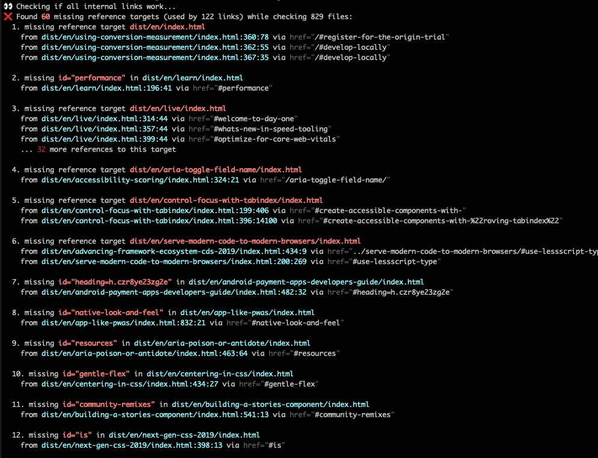

```js server
/* START - Rocket auto generated - do not touch */
export const sourceRelativeFilePath = '30--tools/40--check-html-links/10--overview.rocket.md';
// prettier-ignore
import { html, layout, setupUnifiedPlugins, components, openGraphLayout } from '../../recursive.data.js';
export { html, layout, setupUnifiedPlugins, components, openGraphLayout };
export async function registerCustomElements() {
  // server-only components
  // prettier-ignore
  customElements.define('rocket-social-link', await import('@rocket/components/social-link.js').then(m => m.RocketSocialLink));
  // prettier-ignore
  customElements.define('rocket-header', await import('@rocket/components/header.js').then(m => m.RocketHeader));
  // prettier-ignore
  customElements.define('inline-notification', await import('@rocket/components/inline-notification.js').then(m => m.InlineNotification));
  // prettier-ignore
  customElements.define('rocket-main-docs', await import('@rocket/components/main-docs.js').then(m => m.RocketMainDocs));
  // prettier-ignore
  customElements.define('rocket-content-area', await import('@rocket/components/content-area.js').then(m => m.RocketContentArea));
  // hydrate-able components
  // prettier-ignore
  customElements.define('rocket-search', await import('@rocket/search/search.js').then(m => m.RocketSearch));
  // prettier-ignore
  customElements.define('rocket-drawer', await import('@rocket/components/drawer.js').then(m => m.RocketDrawer));
}
export const needsLoader = true;
/* END - Rocket auto generated - do not touch */

export const title = 'Check HTML links';
export const subTitle = 'A fast checker for broken links/references in HTML files';
```

# Overview

A fast checker for broken links/references in HTML files.

<inline-notification type="tip">

Read the [Introducing Check HTML Links - no more bad links](../../40--blog/001--introducing-check-html-links.rocket.md) Blog post to find out how it came to be and how it works.

</inline-notification>

## Features

- Checks all html files for broken local links/references (in href, src, srcset)
- Focuses on the broken reference targets and groups references to it
- Fast (can process 500-1000 documents in ~2-3 seconds)
- Has only 3 dependencies (and 19 in the full tree)
- Uses [sax-wasm](https://github.com/justinwilaby/sax-wasm) for parsing streamed HTML

## Installation

```shell
npm i -D check-html-links
```

## CLI flags

| Name                | Type    | Description                                                                                         |
| ------------------- | ------- | --------------------------------------------------------------------------------------------------- |
| root-dir            | string  | the root directory to serve files from. Defaults to the current working directory                   |
| ignore-link-pattern | string  | do not check links matching the pattern                                                             |
| continue-on-error   | boolean | if present it will not exit with an error code - useful while writing or for temporary passing a ci |
| validate-externals  | boolean | if present it will validate external links making a request to the linked url                       |

## Usage Examples

```bash
# check a folder _site
npx check-html-links _site

# ignore all links like <a href="/users/123">
npx check-html-links _site --ignore-link-pattern "/users/*" "/users/**/*"

# ignore all links like <a href="/users/123"> & <a href="/users/123/details">
npx check-html-links _site --ignore-link-pattern "/users/*" "/users/**/*"

# check external urls
npx check-html-links _site --validate-externals
```

## Example Output



## Comparison

Checking the output of [11ty-website](https://github.com/11ty/11ty-website) with 13 missing reference targets (used by 516 links) while checking 501 files. (on January 17, 2021)

| Tool             | Lines printed | Times  | Lang | Dependency Tree |
| ---------------- | ------------- | ------ | ---- | --------------- |
| check-html-links | 38            | ~2.5s  | node | 19              |
| link-checker     | 3000+         | ~11s   | node | 106             |
| hyperlink        | 68            | 4m 20s | node | 481             |
| htmltest         | 1000+         | ~0.7s  | GO   | -               |
