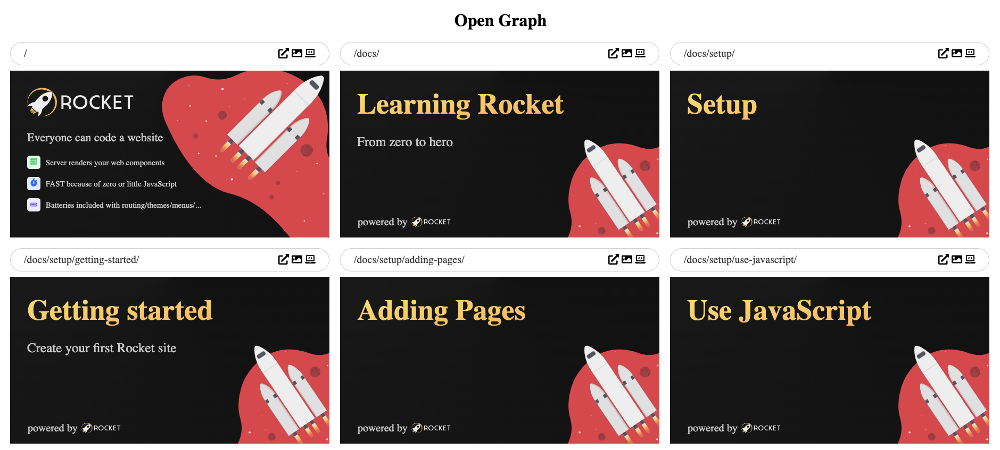

```js server
/* START - Rocket auto generated - do not touch */
export const sourceRelativeFilePath = '40--blog/003--open-graph-images/index.rocket.md';
import { html, setupUnifiedPlugins, components, openGraphLayout } from '../../recursive.data.js';
import { layout } from '../recursive.data.js';
export { html, layout, setupUnifiedPlugins, components, openGraphLayout };
export async function registerCustomElements() {
  // server-only components
  // prettier-ignore
  customElements.define('rocket-social-link', await import('@rocket/components/social-link.js').then(m => m.RocketSocialLink));
  // prettier-ignore
  customElements.define('rocket-header', await import('@rocket/components/header.js').then(m => m.RocketHeader));
  // prettier-ignore
  customElements.define('launch-blog-details', await import('@rocket/launch/blog-details.js').then(m => m.LaunchBlogDetails));
  // prettier-ignore
  customElements.define('rocket-main', await import('@rocket/components/main.js').then(m => m.RocketMain));
  // prettier-ignore
  customElements.define('rocket-content-area', await import('@rocket/components/content-area.js').then(m => m.RocketContentArea));
  // hydrate-able components
  // prettier-ignore
  customElements.define('rocket-search', await import('@rocket/search/search.js').then(m => m.RocketSearch));
  // prettier-ignore
  customElements.define('rocket-drawer', await import('@rocket/components/drawer.js').then(m => m.RocketDrawer));
}
export const needsLoader = true;
/* END - Rocket auto generated - do not touch */

import { thomas } from '../../../src/data/authors.js';

export const publishDate = new Date('2022-03-31');
export const description =
  'When you want to share a link to your website on social media it is important to include an Open Graph image. This means that a nice preview image will be shown which will make the link more attractive to click on.';

export const tags = ['rocket', 'javascript', 'node', 'SSG'];
export const authors = [thomas];
```

# Supporting Open Graph Images

We now have support for Open Graph Images out of the box 💪
Let's dive in and see what we can do with it!

https://next.rocket.modern-web.dev/docs/guides/social-media/

---

First up - what the hell is an Open Graph Image? 🤔

It is the preview image you see when sharing links on Discord, Twitter, Telegram, and other social media.
As it is important that links to your website stand out from the rest of the content on social media you should add one.


---

There are many size variations but it's usually similar.

➡️ Facebook: 1200 x 628 <br>
➡️ Twitter: 1200 x 628 <br>
➡️ LinkedIn: 1200 x 627 <br>
➡️ ... <br>

We will multiply that value by two to have an optimal display on retina screens.

Once we have an image we add it as a meta tag to our HTML.

---

You may think "what is the fuss about?" create this image once and you are done.

Not so fast! Every page should have a unique image and it should reflect the content of the page.

We wanted to stand out on social media so we will need to go the extra mile.


---

Luckily Rocket can help 💪

How does it work?

1️⃣ Pages with an `openGraphLayout` create an additional `index.opengraph.html` file <br>
2️⃣ During the build phase puppeteer opens the file and takes a screenshot <br>
3️⃣ It injects meta tags (with an absolute URL to this image) <br>

---

Let's set up Open Graph images for our site.

1️⃣ On the page we export data that gets passed to the layout <br>
2️⃣ Add `export const openGraphLayout = data => ...` to `recursive.data.js` so it gets injected into every page <br>
3️⃣ Define the `absoluteBaseUrl` in our config <br>

👉 `index.rocket.js`

```js
export const openGraphTitle = 'Welcome to My Site';
export const subTitle = 'This is my site';

export default () => html`<h1>Home</h1>`;
```

👉 `recursive.data.js`

```js
export const openGraphLayout = data => html`
  <!DOCTYPE html>
  <html lang="en">
    <head>
      <meta charset="utf-8" />
      <style>
        body {
          background: #ccc;
        }
      </style>
    </head>
    <body>
      <h1>${data.openGraphTitle}</h1>
      <p id="sub-title">${data.subTitle || ''}</p>
    </body>
  </html>
`;
```

👉 `config/rocket.config.js`

```js
/** @type {import('@rocket/cli/types/main').RocketCliOptions} */
export default {
  absoluteBaseUrl: 'https://my-site.com/',
};
```

---

Let's take a look

1️⃣ Start Rocket via `npm start` <br>
2️⃣ Open the browser on `http://localhost:8000/index.opengraph.html` <br>
3️⃣ Open Dev Tools and set width to `1200px` and height to `628px` and zoom to `50%` <br>

We can now adjust the HTML until we are satisfied with the result.


---

After some tinkering we get to our final result:

1️⃣ Picked a gradient from https://open-props.style/#gradients <br>
2️⃣ Used a web font <br>
3️⃣ Used server web components to inline font awesome svg icons <br>
4️⃣ Added an image via a private import <br>

---

```js
export const openGraphLayout = data => html`
  <!DOCTYPE html>
  <html lang="en">
    <head>
      <meta charset="utf-8" />
      <link
        rel="preload"
        href="/fonts/Rubik-VariableFont_wght.woff2"
        as="font"
        type="font/woff2"
        crossorigin
      />
      <style type="text/css">
        @font-face {
          font-family: 'Rubik';
          src: url('/fonts/Rubik-VariableFont_wght.woff2') format('woff2 supports variations'), url('/fonts/Rubik-VariableFont_wght.woff2')
              format('woff2-variations');
          font-weight: 1 999;
          font-display: optional;
        }
        body {
          font-family: 'Rubik', sans-serif;
          background: conic-gradient(from 90deg at 50% 0%, #111, 50%, #222, #111);
          color: #ccc;
          font-size: 30px;
          display: block;
          height: 100vh;
          padding: 30px;
          box-sizing: border-box;
          margin: 0;
        }
        #logo {
          width: 35%;
          margin-top: 3%;
          margin-left: 3%;
        }
        p {
          margin-left: 3%;
        }
        #sub-title {
          font-size: 44px;
        }
        #bg-wrapper {
          position: absolute;
          width: 100vw;
          height: 100vh;
          overflow: hidden;
          left: 0;
          top: 0;
        }
        #bg-wrapper img {
          position: absolute;
          right: -15%;
          top: -6%;
          transform: rotate(45deg);
          width: 61%;
          z-index: 10;
        }
        .item {
          display: flex;
          align-items: center;
          gap: 20px;
        }
        .item rocket-icon-card {
          width: 50px;
          height: 50px;
        }
      </style>
    </head>
    <body>
      
      <div id="bg-wrapper">
        
      </div>
      <p id="sub-title">${data.subTitle || ''}</p>

      <p class="item">
        <rocket-icon-card icon="solid/server" variation="green"></rocket-icon-card>
        <span>Server renders your web components</span>
      </p>

      <p class="item">
        <rocket-icon-card icon="solid/stopwatch" variation="blue"></rocket-icon-card>
        <span>FAST because of zero or little JavaScript</span>
      </p>

      <p class="item">
        <rocket-icon-card icon="solid/battery-full"></rocket-icon-card>
        <span>Batteries included with routing/themes/menus/...</span>
      </p>
    </body>
  </html>
`;
```


---

Once you have multiple pages maybe even with multiple different open graph layouts it is hard to check if all images are "correct" in the sense of the text is not too long/short and images are not overlapping.

But fear not we can create our own overview of all pages.

---

The Open Graph Overview features

➡️ Using Rockets PageTree to get a list of all pages <br>
➡️ Showing Open Graph pages <br>
➡️ Opening URLs <br>
➡️ Opening Open Graph pages <br>
➡️ Opening source files in VSCode <br>

<video controls>
  <source src="./open-graph-overview.mp4" type="video/mp4">
</video>

---

We can get this overview by creating a pageTree and then passing on all the URLs and sourceRelativeFilePath to a web component.

👉 `opengraph.rocket.js`

```js
// alternatively you could import a pageTree instance if you already have it
import { PageTree } from '@rocket/engine';
export const pageTree = new PageTree();
await pageTree.restore(new URL('./pageTreeData.rocketGenerated.json', import.meta.url));

// if you do this globally then it won't be needed here
import { rocketComponents } from '@rocket/components/components';
export const components = rocketComponents;

export const menuExclude = true;

const pages = pageTree.all().map(node => ({
  url: node.model.url,
  sourceRelativeFilePath: node.model.sourceRelativeFilePath,
}));

export default () => html`
  <h1>Open Graph</h1>

  <rocket-opengraph-overview
    .pages="${pages}"
    input-dir=${new URL('./', import.meta.url).pathname}
  ></rocket-opengraph-overview>
`;

export const layout = data => html`
  <!DOCTYPE html>
  <html lang="en">
    <head>
      <meta charset="utf-8" />
      <style>
        body {
          margin: 20px;
        }
        h1 {
          text-align: center;
        }
      </style>
    </head>
    <body>
      ${data.content()}
    </body>
  </html>
`;
```



---

Thats it! Now you have individual Open Graph images for all your pages 🎉

This is one of the things that sets Rocket apart as most other solutions do not offer automatic open graph image templates out of the box 💪

---

If you wanna know more about what Rocket is and how it works then see the initial sharing thread

https://twitter.com/daKmoR/status/1506601983293235209?s=20&t=aGaF5ZBiBQxGFGvJ6DZrjQ
