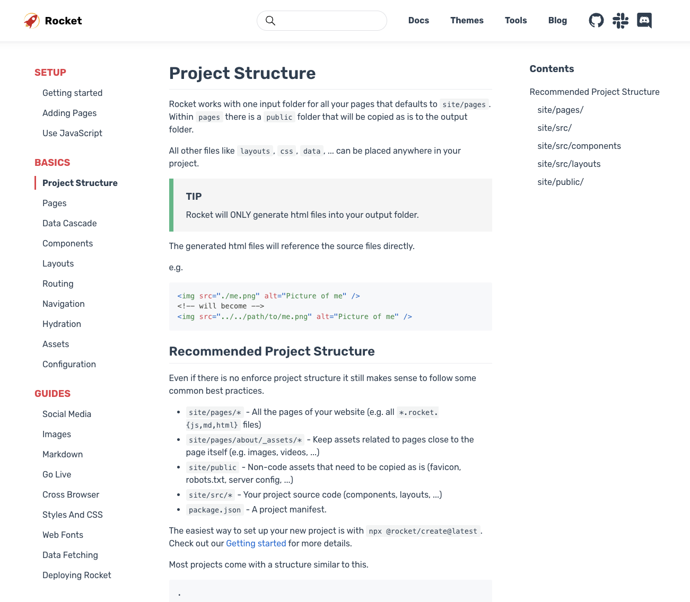
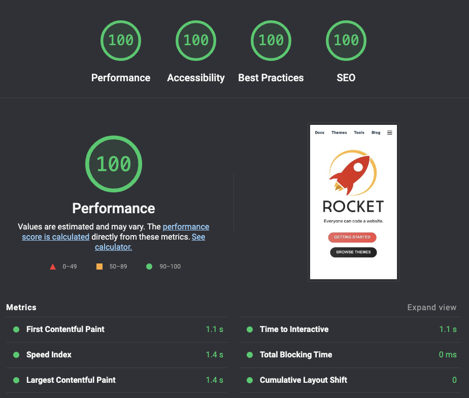
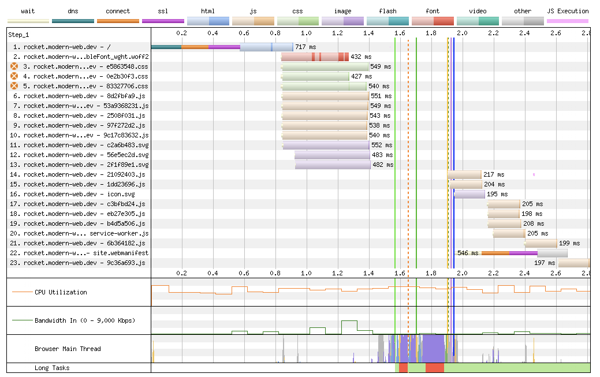

```js server
import { thomas } from '../../../src/data/authors.js';

export const description = 'Rocket is now in beta. It is time you check it out.';
export const publishDate = new Date('2022-08-23');

export const tags = ['rocket', 'javascript', 'node', 'SSG'];
export const authors = [thomas];
```

# It is time 🕑

I did not share much about Rocket recently but it's going great 💪

It's now in beta and if you have been curious before then it's a good time to check it out.

👇

https://rocket.modern-web.dev

<!-- --- -->

## What has happened since the last update?

1️⃣ Engine version became the main release <br>
2️⃣ @rocket/components for SSR & hydration <br>
3️⃣ Rewrite of themes (@rocket/launch & @rocket/spark) <br>
4️⃣ `rocket preview` <br>
5️⃣ `rocket lint` <br>

Let's take a closer look.

<!-- --- -->

## Main release

The journey from the first prototype to a dedicated package to adding build time SSR to supporting hydration has been challenging but also very rewarding.

Rocket is the first SSG that enables you to write your whole page in template literals and web components. 💪

<!-- --- -->

## ✨ Rocket highlights ✨

✍️ Author in Markdown, HTML or JS <br>
🚀 Build everything in Web Components <br>
🪶 Ship 0 JS for Web Components by default <br>
🌊 Hydrate Web Components as needed <br>
🎨 Theme System <br>
🖼️ Social Media Images <br>
✅ Link Checking <br>

<!-- --- -->

## `@rocket/components` for SSR & hydration

➡️ Very early but it makes the existing themes so fast <br>
➡️ All components are rendered on the server and can be hydrated if needed <br>
➡️ Add to components and use them <br>
➡️ Docs are lacking 🙈 see source (for now) <br>

https://github.com/modernweb-dev/rocket/tree/main/packages/components/src

👉 `site/pages/recursive.data.js`

```js
import { rocketComponents } from '@rocket/components/components.js';

export const components = {
  ...rocketComponents,
  'my-counter': '#src/components/MyCounter.js::MyCounter',
};
```

👉 `site/pages/index.rocket.html`

```html
<h1>Welcome to My Page</h1>

<rocket-details>
  <span slot="summary"> I'm often asked by parents</span>
  <div>
    what advice can I give them to help get kids interested in science? And I have only one bit of
    advice. Get out of their way. Kids are born curious. Period.
  </div>
</rocket-details>
```

<!-- --- -->

## 📖 The Documentation Theme (Launch)

➡️ Starts with ~2kb of main thread js (+ ~3kb for service worker) <br>
➡️ Hydrates components as needed <br>
➡️ Works without JavaScript if Declarative Shadow Dom (DSD) is supported <br>
➡️ awesome performance <br>
➡️ Example: https://rocket.modern-web.dev <br>





<!-- --- -->

## ✨ The Landing Page Theme (Spark)

➡️ Similar characteristics to Launch <br>
➡️ Uses 8 web components <br>
➡️ Only 1 gets hydrated at start <br>
➡️ Example: https://rocket-spark.modern-web.dev/ <br>


<!-- --- -->

## 🕑 Getting started

🕑 Getting started with any theme takes you only 5 minutes <br>
🏃‍♂️ Run "npx @rocket/create@latest" in the terminal <br>
🎯 Choose your template and start coding! <br>

PS: It creates a folder for you now worries 🤗

```
npx @rocket/create@latest
        |          Welcome to Rocket! (®rocket/create v0.1.0)
       / \         Everyone can code a website
      / _ \
     |.o '.|       You are about to embark upon a new mission 🚀.
     |'._.'|
     |     |
   ,'|  |  |`.
  /  |  |  |  \    If you encounter a problem, visit
  |,-'--|--'-.|      https://github.com/modernweb-dev/rocket/issues
      ( | )        to search or file a new issue
     ((   ))
    ((  :  ))      Follow us: https://twitter.com/modern_web_dev
     ((   ))       Chat with us: https://rocket.modern-web.dev/chat
      (( ))
       ( )         Notes: You can exit any time with Ctrl+C or Esc
        .                 A new folder "rocket-<template name>" will be created
        .

? Which Starter Template would you like to use? › - Use arrow-keys. Return to submit.
❯   Hydration Starter - Example on how to hydrate web components
    Blog Starter
    Minimal Starter
    Sanity Minimal Starter
    Landing Page (@rocket/spark Theme)
    Documentation Website (@rocket/launch Theme)
    Custom (community built)
```

<!-- --- -->

## `rocket preview`

With `rocket preview` we can check after a production build if everything is in order.

➡️ Uses a plain web server without any features <br>
➡️ If it works there then `_site` is good to ship to your production web server <br>

```
👀 Previewing Production Build

  🚧 Local:    http://localhost:8000/
  🌐 Network:  http://xxx.xxx.xxx.xxx:8000/
  📝 Source:   /projects/rocket/_site

If what you see works as expected then you can upload "source" to your production web server.
```

<!-- --- -->

## `rocket lint`

Launching a new site and the first feedback is "this link is broken" 🙈

Not anymore with `rocket lint` 💪

➡️ Checks asset urls like css, images, scripts, ... <br>
➡️ Checks internal links (incl. if ids exist for anchors) <br>
➡️ It is fast and can/should be used in the CI <br>

```
npx rocket lint
👀 Checking if all internal links work...
🔥 Found a total of 57 files to check!
🔗 Found a total of 4401 links to validate!

✅ All internal links are valid. (executed in 0s 299.021433ms)

============================================================

npx rocket lint
👀 Checking if all internal links work...
🔥 Found a total of 57 files to check!
🔗 Found a total of 4401 links to validate!

❌ Found 1 missing reference targets (used by 1 links) while checking 57 files:
  1. missing reference target _site/docs/basics/super-pages/index.html
    from _site/docs/guides/index.html:1213:15 via href="/docs/basics/super-pages/"

Checking links duration: 0s 296.371296ms
```

## There are two modes:

1️⃣ Check the production build in `_site` (need to execute "rocket build" before) <br>
2️⃣ Run a fast html only build and then check it <br>

Use 1️⃣ in your CI and 2️⃣ while fixing links locally

```bash
# use this in CI
# check existing production build in _site (need to execute "rocket build" before)
rocket lint

# use this while fixing broken links
# run a fast html only build and then check it
rocket lint --build-html
```

<!-- --- -->

## That's all folks! 🤗

💬 We are very hungry for feedback to continue polishing Rocket.

If you have any questions, comments or suggestions, please open an issue, create a pull request or join us on Discord or Slack.

https://rocket.modern-web.dev/chat

```js server
/* START - Rocket auto generated - do not touch */
export const sourceRelativeFilePath = '40--blog/005--its-time/index.rocket.md';
import { html, setupUnifiedPlugins, components, openGraphLayout } from '../../recursive.data.js';
import { layout } from '../recursive.data.js';
export { html, layout, setupUnifiedPlugins, components, openGraphLayout };
export async function registerCustomElements() {
  // server-only components
  // prettier-ignore
  customElements.define('rocket-social-link', await import('@rocket/components/social-link.js').then(m => m.RocketSocialLink));
  // prettier-ignore
  customElements.define('rocket-header', await import('@rocket/components/header.js').then(m => m.RocketHeader));
  // prettier-ignore
  customElements.define('launch-blog-details', await import('@rocket/launch/blog-details.js').then(m => m.LaunchBlogDetails));
  // prettier-ignore
  customElements.define('rocket-main', await import('@rocket/components/main.js').then(m => m.RocketMain));
  // prettier-ignore
  customElements.define('rocket-content-area', await import('@rocket/components/content-area.js').then(m => m.RocketContentArea));
  // hydrate-able components
  // prettier-ignore
  customElements.define('rocket-search', await import('@rocket/search/search.js').then(m => m.RocketSearch));
  // prettier-ignore
  customElements.define('rocket-drawer', await import('@rocket/components/drawer.js').then(m => m.RocketDrawer));
}
export const needsLoader = true;
/* END - Rocket auto generated - do not touch */
```
