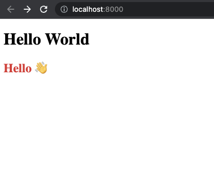
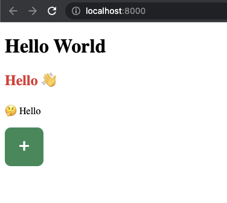

🚨 Feature Alert 🚨

Rocket improves the way it handles web components 🎉

➡️ maintain a list of available tag names and it's imports
➡️ automatically injects imports as needed
➡️ enables progressive hydration 💪

How does it work? 👇

---

First, we start by creating a very simple web component

We call it `hello-wave` and it has some static HTML & CSS

👉 `site/src/components/HelloWave.js`

```js
import { LitElement, html, css } from 'lit';

export class HelloWave extends LitElement {
  render() {
    return html`<h2>Hello 👋</h2>`;
  }

  static styles = css`
    h2 {
      color: #e03131;
    }
  `;
}
```

---

We then add it to the rocket components object in the format of
'tag-name': 'bare-import::ClassName'

➡️ It needs to be a bare import as we do not know in which file it will be imported
➡️ A separating entrypoint for each class allows us to load them individually

👉 `data/pages/recursive.data.js`

```js
export const components = {
  'hello-wave': 'my-pkg/site/src/components/HelloWave.js::HelloWave',
};
```

---

Now we can start using the component on our pages.

➡️ Save our file
➡️ Component Registration gets injected
➡️ Component gets server rendered to Declarative Shadow DOM

PS: adding component registration to the page had was inspired by a discussion with @fcamblor 🙇‍♂️

👉 `site/pages/index.rocket.js`

```js
export default () => html`
  <h2>Hello World</h2>
  <hello-wave></hello-wave>
`;
```

```js
/* START - Rocket auto generated - do not touch */
export const sourceRelativeFilePath = 'index.rocket.js';
import { html, components, layout } from './recursive.data.js';
export { html, components, layout };
export async function registerCustomElements() {
  // server-only components
  // prettier-ignore
  customElements.define('hello-wave', await import('my-pkg/site/src/components/HelloWave.js').then(m => m.HelloWave));
}
/* END - Rocket auto generated - do not touch */

export default () => html`
  <h1>Hello World</h1>
  <hello-wave></hello-wave>
`;
```

```html
<h2>Hello World</h2>
<hello-wave>
  <template shadowroot="open">
    <style>
      h2 {
        color: #e03131;
      }
    </style>
    <!--lit-part 18Qb0exw8us=-->
    <h2>Hello 👋</h2>
    <!--/lit-part-->
  </template>
</hello-wave>
```



---

Thats it! 🎉

For components that only require styles and no interactivity we are done.

➡️ The HTML output works without any JavaScript
➡️ It's crystal clear which components are used on the page
➡️ You do not need to hand write the imports

So are we done? 🤔

---

Actually - this is where the fun starts 🎉

Let's add a more interactive element
✍️ a type writer effect
🔼 with a counter 🤯

👉 `site/src/components/HelloTyper.js`

```js
import { LitElement, html, css } from 'lit';

let i = 0;
const fullText = [...'to this wonderful world of progressive hydration 🤯'];

export class HelloTyper extends LitElement {
  static properties = {
    msg: { type: String },
    counter: { type: Number },
  };

  constructor() {
    super();
    this.msg = ' ';
    this.counter = 0;
  }

  updated(changedProperties) {
    super.updated(changedProperties);
    if (i < fullText.length) {
      setTimeout(() => {
        this.msg += fullText[i];
        i += 1;
      }, Math.floor(Math.random() * 50) + 40);
    }
  }

  render() {
    return html`
      <p>🤔 Hello <span>${this.msg}</span>${'🤯'.repeat(this.counter)}</p>
      <button @click=${this._inc}>+</button>
    `;
  }

  _inc() {
    if (i >= fullText.length) {
      this.counter += 1;
    }
  }

  static styles = [
    css`
      button {
        font-size: 200%;
        width: 64px;
        height: 64px;
        border: none;
        border-radius: 10px;
        background-color: seagreen;
        color: white;
      }
    `,
  ];
}
```

---

Now if we add this to our page we get...

✅ our component rendered
❌ ...with no typing effect
❌ ...and with a button that is not doing anything

👉 `site/pages/index.rocket.js`

```js
export async function registerCustomElements() {
  // server-only components
  // prettier-ignore
  customElements.define('hello-wave', await import('my-pkg/site/src/components/HelloWave.js').then(m => m.HelloWave));
  // prettier-ignore
  customElements.define('hello-typer', await import('my-pkg/site/src/components/HelloTyper.js').then(m => m.HelloTyper));
}

export default () => html`
  <h1>Hello World</h1>
  <hello-wave></hello-wave>
  <hello-typer></hello-typer>
`;
```



---

We get this because our component is now more than "just" text.
It now has interactive functionality.

Which means that if we only send HTML & CSS to the browser it will not be enough.

---

We can now decide to skip the server render and render the component purely client side.

We can do that by putting `loading="client"` on the component.

```js
export async function registerCustomElements() {
  // server-only components
  // prettier-ignore
  customElements.define('hello-wave', await import('my-pkg/site/src/components/HelloWave.js').then(m => m.HelloWave));
  // client-only components
  // 'hello-typer': () => import('my-pkg/site/src/components/HelloTyper.js').then(m => m.HelloTyper),
}

export default () => html`
  <h1>Hello World</h1>
  <hello-wave></hello-wave>
  <hello-typer loading="client"></hello-typer>
`;
```

---

This however has a few downsides:

➡️ component does not get rendered initially but only after loading is done
➡️ brings a layout shift
➡️ delays initial render
➡️ requires search engines to execute JS to see the content (some do, some don't)

<video src="./typer-client.mp4"></video>

---

Or we do ✨ Progressive Hydration ✨

Progressive stands for?

➡️ Start with 0 JavaScript of components
➡️ Load components as needed

---

Hydrations stands for?

1️⃣ Server render (ships HTML with Declarative Shadow Dom)
2️⃣ Client loads the components JS Code (as needed)
3️⃣ Rerender the component (sync DOM/JS - no change)
4️⃣ Now the component can be interacted with

---

To enable hydration we put `loading="hydrate:onVisible"` on the component.

```js
export async function registerCustomElements() {
  // server-only components
  // prettier-ignore
  customElements.define('hello-wave', await import('my-pkg/site/src/components/HelloWave.js').then(m => m.HelloWave));
  // hydrate-able components
  // prettier-ignore
  customElements.define('hello-typer', await import('my-pkg/site/src/components/HelloTyper.js').then(m => m.HelloTyper));
}

export default () => html`
  <h1>Hello World</h1>
  <hello-wave></hello-wave>
  <hello-typer loading="hydrate:onVisible"></hello-typer>
`;
```

---

By hydrating our component as soon as it becomes visible we get

➡️ component getting rendered as static content
➡️ no layout shift or delayed render
➡️ interactive components as loading conditions are met

<video src="./typer-hydration.mp4"></video>

---

There are multiple conditions you can combine to get the best loading strategy for your use case:
➡️ media query (screen size, reduced motion, ...)
➡️ client load
➡️ click
➡️ visible
➡️ idle
➡️ ...

```html
<h1>Rocket Blog</h1>
<inline-notification>Do this</inline-notification>
<!-- 👆 will be only server rendered -->

<my-hero loading="hydrate:onClientLoad">
  Welcome ...
</my-hero>
<!-- 👆 server render + hydrate as soon as possible -->

<my-list loading="hydrate"></my-list>
<!-- 👆 server render + hydrate if main thread is idle  -->

<my-chart loading="hydrate:onVisible"></my-chart>
<!-- 👆 server render + hydrate as element becomes visible  -->

<my-heavy-chart loading="onVisible || onMedia('(min-width: 768px)')"></my-heavy-chart>
<!-- 👆 server render + hydrate -->
<!-- desktop: hydrate immediately (matches media query) -->
<!-- mobile: hydrate as element becomes visible -->

<my-heavy-graph loading="hydrate:onMedia('(min-width: 768px)') && onVisible || onClick"></my-heavy-graph>
<!-- 👆 server render + hydrate -->
<!-- desktop: hydrate as element becomes visible -->
<!-- mobile: hydrate on click (to safe bandwidth) -->

<my-login loading="client"></m-login>
<!-- 👆 only client render -->
```

---

With that we should have all the stepping stones to build

🏃‍♂️ Fast
🔻 Small (as we start with next to 0 JS)
💪 No Magic

websites 🎉

Go check it out

https://next.rocket.modern-web.dev/docs/basics/hydration/

---

Or try it for yourself 💪

👨‍💻 `npx @rocket/create@latest`

and select the "Hydration Starter"

There is also a production deployment of this example

https://rocket-hydration-starter.netlify.app/

```
npx @rocket/create@latest
        |          Welcome to Rocket! (®rocket/create v0.0.7)
       / \         Everyone can code a website
      / _ \
     |.o '.|       You are about to embark upon a new mission 🚀.
     |'._.'|
     |     |
   ,'|  |  |`.
  /  |  |  |  \    If you encounter a problem, visit
  |,-'--|--'-.|      https://github.com/modernweb-dev/rocket/issues
      ( | )        to search or file a new issue
     ((   ))
    ((  :  ))      Follow us: https://twitter.com/modern_web_dev
     ((   ))       Chat with us: https://next.rocket.modern-web.dev/chat
      (( ))
       ( )         Notes: You can exit any time with Ctrl+C or Esc
        .                 A new folder "rocket-<template name>" will be created
        .

? Which Starter Template would you like to use? › - Use arrow-keys. Return to submit.
❯   Hydration Starter - Example on how to hydrate web components
    Blog Starter
    Minimal Starter
    Sanity Minimal Starter
    Landing Page (Spark Theme)
    Custom (community built)
```

---

If you wanna know more what Rocket is then be sure to check out the initial release thread

https://twitter.com/daKmoR/status/1506601983293235209?s=20&t=ujwk5xxUu89jqTALfX9PzA

---

If you have any questions or are interested in topics like

➡️ Web Standards
➡️ Template Literals
➡️ Web Components
➡️ Hydration
➡️ Static Site Generator (SSG)
➡️ ...

then you should join our Discord Community 🤗

https://discord.gg/sTdpM2rkKJ
